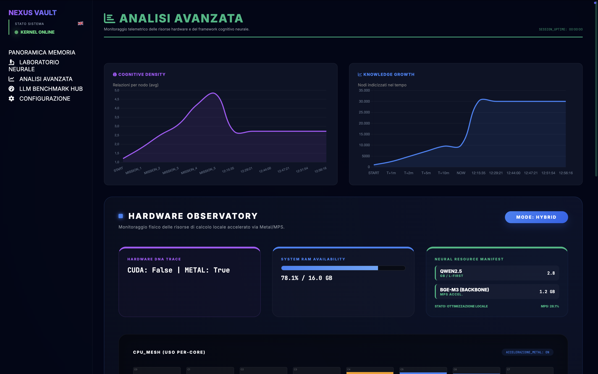
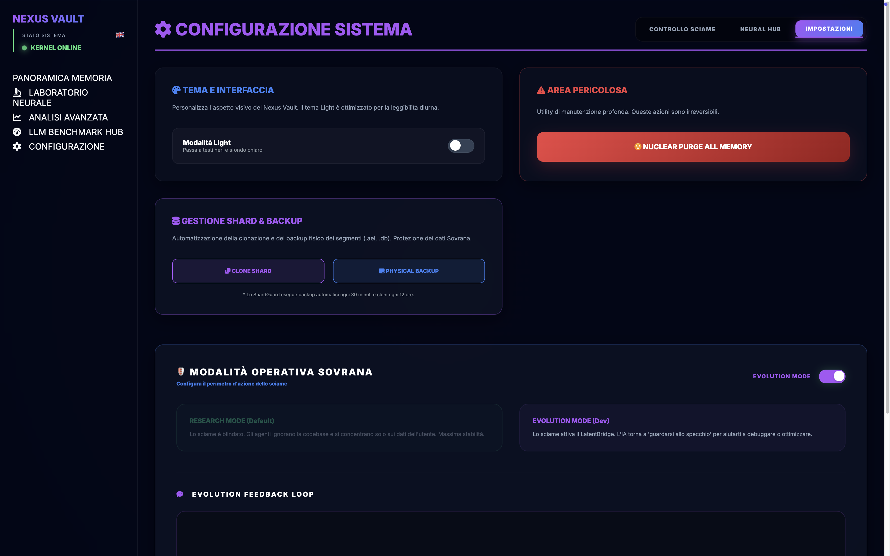

# 🏺 NeuralVault — The Sovereign Agentic Knowledge OS (v3.5.0)
> **"Turning raw information into active, sovereign wisdom through kinetic swarm orchestration."**

---

## 📜 Vision: Beyond Static Memory
Traditional RAG is reactive and suffers from "informational obesity." **NeuralVault v3.5.0** transforms knowledge management into a biological process. It's not just a database, but a **Cognitive Operating System** where knowledge fades, connects, and evolves autonomously through a proactive swarm.

---

## 🏗️ I. 3-TIER PERSISTENT ARCHITECTURE
Designed to balance atomic speed and cryptographic integrity on local hardware.

1.  **Tier L1 (Atomic RAM)**: High-performance registry with **`mlock` (Hardware Pinning)**. Latency < 1µs. Essential for 60fps 3D rendering.
2.  **Tier L2 (AegisLogStore)**: **AOBF** binary storage. Manages the "Tombstone Paradox" and asynchronous compaction via **Aegis Reaper**. Real Zero-Waste.
3.  **Tier L3 (Contextual Archive)**: Analytical engine based on **DuckDB**. Handles complex metadata and **RRF (Reciprocal Rank Fusion)** hybrid search.

---

## 🐝 II. THE KINETIC SWARM: THE 9 AGENTS
The swarm is a fleet of threads coordinated via a Synaptic Blackboard. Each agent has a visual identity and a deterministic mission.

*   **🟡 JA-001 (Janitron)**: The Scavenger. Eliminates semantic noise following the Ebbinghaus curve.
*   **🟣 DI-007 (Distiller)**: Prunes weak and redundant connections.
*   **🐍 SN-008 (Snake)**: Drags orphaned nodes toward the center to force integration.
*   **🏗️ QA-101 (Quantum)**: Urbanist. Performs Semantic Centroiding to create **Golden Clusters**.
*   **🛡️ SE-007 (Sentinel)**: Cryptographic validator. Merkle-root integrity and Veto.
*   **✨ SY-009 (Synth)**: The Oracle. Generates **Creative Sparks** during "Neural Dreaming."
*   **⚕️ RP-001 (Reaper)**: The Surgeon. Performs physical binary storage compaction.
*   **📡 FS-77 (SkyWalker)**: The Forager. Fills knowledge gaps by autonomously browsing the web.
*   **🔗 CB-003 (Bridger)**: The Architect. Synchronizes local code (AST) with theoretical documentation.

---

## 🧬 III. MULTIMODAL FABRIC & FORENSICS
NeuralVault "perceives" media through advanced semantic sensors:
*   **Video Scene Detection**: Keyframe extraction based on pixel variance, not fixed time.
*   **Audio Semantic Bridge**: Whisper transcription with "Tone_Weight" analysis.
*   **OCR Spatial Layout**: Maintains spatial proximity of text in images and PDFs.

---

## ⚖️ IV. GOVERNANCE & OBSERVATORY
To ensure data sovereignty against hallucinations and monitor hardware in real-time.

*   **Agent Trust Network**: Dynamic reputation based on user feedback.
*   **Conservative Supreme Court**: 3-judge arbitration (Alpha, Beta, Gamma). In case of a tie, the **Safe-Keep (Tie-break = KEEP)** protocol applies.
*   **Hardware DNA Trace**: Native Metal/MPS monitoring and real-time RAM consumption.

---

## 📊 V. ANALYTICAL COMPARISON & HONESTY

| Feature | Pinecone / Zilliz | Mem0 | **NeuralVault v3.5.0** |
| :--- | :---: | :---: | :---: |
| **Scalability** | **Billions (Cloud)** | Single user | Mesh-Scale (Local) |
| **Setup** | Instant (SaaS) | Simple | **Complex (Rust/HW)** |
| **Privacy** | Variable | Cloud | **Sovereign (Hardware-Locked)** |
| **Intelligent Decay** | No | No | **✅ Ebbinghaus v2** |
| **Proactive Swarm** | No | Base | **✅ 9 Kinetic Agents** |
| **Zero-Waste** | No | No | **✅ Aegis Reaper** |

---

## ⚙️ VI. CONFIGURATION & SOVEREIGNTY
NeuralVault allows granular control over your "synthetic mind."

---

## 🚀 VII. ROADMAP 4.0: BRIDGING THE ENTERPRISE GAP
While cloud giants scale for business, we scale for the mind. v4.0 will introduce:
*   **Logical Namespacing**: Sealed compartments (Professional/Private) via DuckDB.
*   **Lightweight RAFT**: Distributed consensus across your personal devices.
*   **Hybrid Quantization**: 50% RAM reduction to run on entry-level hardware.
*   **Auto-SDK Generation**: OpenAPI support to integrate NeuralVault into any ecosystem.

---

## 👤 About the Author
**Giuseppe Lobbene** — Software architect and builder driven by the need to innovate. I spearheaded the technical growth of a beach-booking startup, scaling revenue by **10x in a single year** through the delivery of complex management software while wearing every hat necessary to ensure success. Despite these results, I faced a market that often fails to reward merit, leading me to seek stability in the construction industry. Yet, my true home is in IT. **NeuralVault is my manifesto**: proof that even at night, after a full day's work, it is possible to build the future of the AI revolution. I am looking for challenges that match my hunger for innovation, to prove to myself and my son **Oliver** that talent and dedication can still change the world.

---
---

# 🏺 NeuralVault — The Sovereign Agentic Knowledge OS (v3.5.0) [ITA]

## 📜 Visione: Oltre la Memoria Statica
Il RAG tradizionale è reattivo e soffre di "obesità informativa". **NeuralVault v3.5.0** trasforma la gestione della conoscenza in un processo biologico. Non è solo un database, ma un **Sistema Operativo Cognitivo** dove la conoscenza sbiadisce, si connette e si evolve autonomamente tramite uno sciame proattivo.

---

## 🏗️ I. ARCHITETTURA PERSISTENTE A 3 LIVELLI
Progettata per bilanciare velocità atomica e integrità crittografica su hardware locale.

1.  **Tier L1 (Atomic RAM)**: Registro ad alta performance con **`mlock` (Hardware Pinning)**. Latenza < 1µs. Fondamentale per il rendering 3D a 60fps.
2.  **Tier L2 (AegisLogStore)**: Storage binario **AOBF**. Gestisce il "Paradosso della Tombstone" e la compattazione asincrona via **Aegis Reaper**. Zero-Waste reale.
3.  **Tier L3 (Contextual Archive)**: Motore analitico basato su **DuckDB**. Gestisce metadati complessi e la ricerca ibrida **RRF (Reciprocal Rank Fusion)**.

---

## 🐝 II. THE KINETIC SWARM: I 9 AGENTI
Lo sciame è una flotta di thread coordinati tramite una Synaptic Blackboard. Ogni agente ha un'identità visiva e una missione deterministica.

*   **🟡 JA-001 (Janitron)**: Lo Scavenger. Elimina il rumore semantico seguendo la curva di Ebbinghaus.
*   **🟣 DI-007 (Distiller)**: Pota le connessioni deboli e ridondanti.
*   **🐍 SN-008 (Snake)**: Trascina i nodi orfani verso il centro per forzare l'integrazione.
*   **🏗️ QA-101 (Quantum)**: Urbanista. Esegue il Semantic Centroiding per creare **Cluster Dorati**.
*   **🛡️ SE-007 (Sentinel)**: Validatore crittografico. Merkle-root integrity e Veto.
*   **✨ SY-009 (Synth)**: L'Oracolo. Genera **Creative Sparks** durante il "Neural Dreaming".
*   **⚕️ RP-001 (Reaper)**: Il Chirurgo. Esegue la compattazione binaria fisica dello storage.
*   **📡 FS-77 (SkyWalker)**: Il Forager. Colma i gap di conoscenza navigando autonomamente sul web.
*   **🔗 CB-003 (Bridger)**: L'Architetto. Sincronizza il codice locale (AST) con la documentazione teorica.

---

## 🧬 III. MULTIMODAL FABRIC & FORENSICS
NeuralVault "percepisce" i media tramite sensori semantici avanzati:
*   **Video Scene Detection**: Estrazione di keyframe basata su varianza pixel, non su tempo fisso.
*   **Audio Semantic Bridge**: Trascrizione Whisper con analisi del "Tone_Weight".
*   **OCR Spatial Layout**: Mantiene la prossimità spaziale dei testi in immagini e PDF.

---

## ⚖️ IV. GOVERNANCE & OBSERVATORY
Per garantire la sovranità del dato contro le allucinazioni e monitorare l'hardware in tempo reale.

*   **Agent Trust Network**: Reputazione dinamica basata sul feedback utente.
*   **Conservative Supreme Court**: Arbitrato a 3 giudici (Alpha, Beta, Gamma). In caso di parità, si applica il protocollo **Safe-Keep (Tie-break = KEEP)**.
*   **Hardware DNA Trace**: Monitoraggio nativo Metal/MPS e consumo RAM in tempo reale.

---

## 📊 V. COMPARAZIONE ANALITICA E ONESTÀ TECNICA

| Caratteristica | Pinecone / Zilliz | Mem0 | **NeuralVault v3.5.0** |
| :--- | :---: | :---: | :---: |
| **Scalabilità** | **Miliardi (Cloud)** | Utente singolo | Mesh-Scale (Local) |
| **Setup** | Istantaneo (SaaS) | Semplice | **Complesso (Rust/HW)** |
| **Privacy** | Variabile | Cloud | **Sovereign (Hardware-Locked)** |
| **Oblio Intelligente** | No | No | **✅ Ebbinghaus v2** |
| **Swarm Proattivo** | No | Base | **✅ 9 Agenti Cinetici** |
| **Zero-Waste** | No | No | **✅ Aegis Reaper** |

---

## 👤 Chi sono
**Giuseppe Lobbene** — Architetto software e costruttore spinto dalla necessità di innovare. Ho guidato la crescita tecnica di una startup nel settore del booking balneare, portando il fatturato a un incremento di **10x in un solo anno** attraverso lo sviluppo di gestionali complessi e ricoprendo ogni ruolo necessario per garantire la consegna. Nonostante i risultati, mi sono scontrato con un mercato che spesso non valorizza il merito, costringendomi a cercare stabilità nel settore edile. Ma la mia vera casa è l'informatica. **NeuralVault è il mio manifesto**: la prova che, anche di notte e dopo una giornata di lavoro, è possibile costruire il futuro della rivoluzione AI. Cerco sfide all'altezza della mia fame di innovazione, per dimostrare a me stesso e a mio figlio **Oliver** che il talento e la dedizione possono ancora cambiare il mondo.

---

🏺 **NeuralVault: Turning Information into Active Wisdom.**
**Temprato per la realtà. Sovrano per sempre.**
